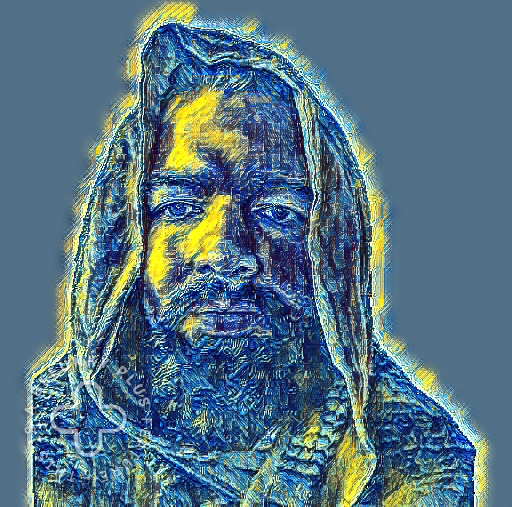
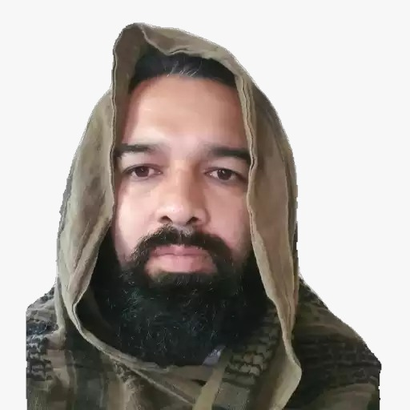

# 👋 Hi, I'm Dr. Josué Molina Rodríguez

**Physicist (CERN – LHCb)** • **Data Scientist** • **AI Trainer** • **STEM Educator**  
🏆 *Breakthrough Prize in Fundamental Physics (2025)*  
🌎 *Ranked #1 Scientist in Honduras & Central America (AD Scientific Index 2021–2025)*  

---

### 🧠 About Me
I am a particle physicist and data scientist specializing in **CP violation** and **data-driven modeling**. I earned my Ph.D. in Physics from **PUC-Rio (Brazil)** and completed a postdoctoral fellowship at the **Brazilian Center for Research in Physics (CBPF)**.  
I’ve been part of the **LHCb Collaboration at CERN**, contributing to analyses that explore matter–antimatter asymmetries and the origin of the universe’s mass balance.

Currently, I bridge **science and AI** — applying rigorous analytical methods to model evaluation, data curation, and AI reasoning training.  
I also teach and mentor STEM students as **Associate Professor at Zamorano University**, where I helped establish its first-ever collaboration with CERN.

---

### 🧩 Research & Technical Skills
- **Physics & Data Analysis:** LHCb experiment, Monte Carlo simulations, statistical inference  
- **Programming:** Python, C/C++, LaTeX (20+ years), data visualization  
- **Machine Learning:** Model training, prompt engineering, dataset curation  
- **STEM Education:** Olympiad-level physics, mathematics, and chemistry problem design  

---

### 🧮 Featured Projects
| Project | Description |
|----------|--------------|
| [`particle_to_ai`](https://github.com/) | Connecting particle physics with neural networks — modeling quantum decay data using ML. |
| [`latin_scientist`](https://github.com/) | Bilingual Python notebooks for STEM teaching (Spanish & Portuguese). |
| [`ai_reasoning_tests`](https://github.com/) | Tools to evaluate reasoning in large language models (Outlier-style evaluation pipelines). |
| [`physics_olympiad_problems`](https://github.com/) | LaTeX and Python problem sets for training Olympiad students. |

---

### 🧠 Personal Philosophy
> “True science bridges imagination and precision — the universe rewards those who explore both.”  

I share reflections on **quantum mechanics, AI ethics, and the philosophy of time** through articles and talks in English, Spanish, and Portuguese.  

---

### 🌐 Connect with Me
[LinkedIn](https://www.linkedin.com/in/jmolinahn) • [Google Scholar](https://scholar.google.com) • [ORCID](https://orcid.org) • [ResearchGate](https://www.researchgate.net) • [Medium](https://medium.com/@jmolinahn) • [Facebook](https://www.facebook.com/josue.molina.37/) • [X (Twitter)](https://x.com/molinajosue) • [YouTube](https://www.youtube.com/@josuemolina8332) • [Academia.edu](https://josuemolina.academia.edu)

---

